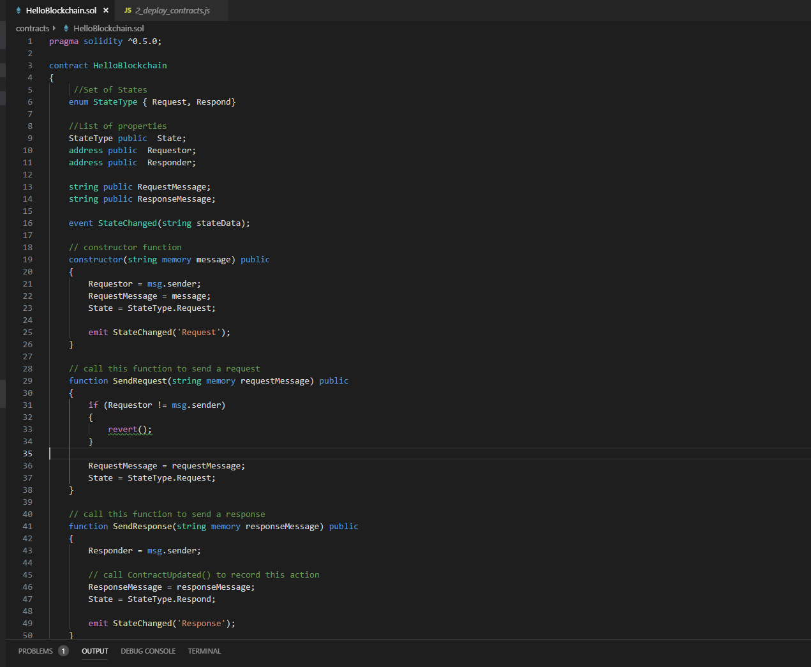

## **Scenario 1 - Create a new Solidity Contract**

Perform the following steps to get familiar with navigating the Azure portal.

1. From the command palette, select `Azure Blockchain: New Solidity Project` . The extension will ask the developer to `Create Basic Project` or `Create Project from Truffle box`

    

    1. `Create Basic Project` will scaffold out a simple Truffle compatible directory structure which includes a basic sample "HelloBlockchain.sol" contract, deployment (migration) files, basic contract test framework as well as basic files for GitHub integration. On completion `Create Basic Project` will build a directory for the developer, which is ready to build, and deploy to a network, with the structure shown below (note you will not have entries in the "Azure Blockchain" window as shown below. That will be added in the next scenario)

       

1. Let's explore this newly scaffolded out environment. The basic project you just created has several files that get written to your workspace. There a few files worth examining in detail

    ##### ./contracts/HelloBlockchain.sol

    The HelloBlockchain.sol file is a simple smart contract that the extension has created for you. This smart contract is a simple chat application where chat messages will be added to the blockchain where developers can view the message, and various states related to the communication flow.

    In this contract you have 3 major functions

    - The constructor - a constructor is a function that is exercised at the time the the contract is deployed to a blockchain. In this case, our constructor takes in one string argument and sets various state variables, plus "emits" an event from the ledger
    - SendRequest - This function can be called at anytime and takes one string argument. 
    - SentResponse - This function can also be called at anytime and takes one string argument

    

    ##### ./contracts/Migrations.sol

    The migrations.sol file is a smart contract that is used by the system to manage the process of adding contracts to the ledger. Developers do not need to modify this contract.

    ##### ./migrations/2_deploy_contracts.js

    In this file, developers can specify deployment options and setup things like the constructor arguments. Notice, in our HelloWorld.sol file the constructor function required a string be passed to it. On deployment, the 2_deploy_contracts.js file will send the string "HelloBlockchain" as an argument to the constructor. Since the contract transaction will need to be signed, we also provide a dummy signing key as a second argument. This signing key can be programatically inserted as well.

    

    ##### ./truffle-config.js

    The truffle-config.js file controls various options used to help compile and deploy a contract. By default, the truffle-config.js file contains a single deployment target - a local (developer) Ethereum blockchain emulator. This emulator (a.k.a., Truffle Ganache) behaves like a real blockchain Ethereum node, but runs locally on the developer machine. In the default configuration a developer can deploy the contract to a local (Ganache) blockchain. Later in this lab, we will connect to the Azure Blockchain Service and deploy a contract there. The extension automatically handles edits/updates to this file and we'll explore those updates in the next scenario

    ##### GitHub Files

    The extension automatically adds typical GitHub files such as the license files, CHANGELOG, .gitignore files etc.

    > This completes this scenario. Click on ***\*Next\**** to go to the next scenario.

    