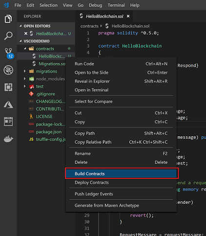
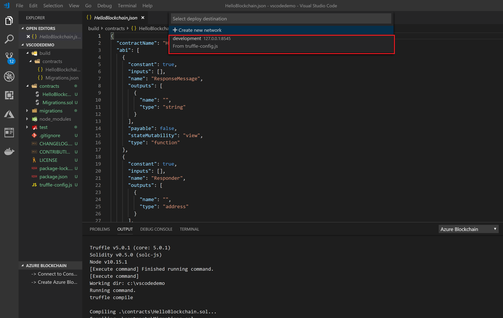
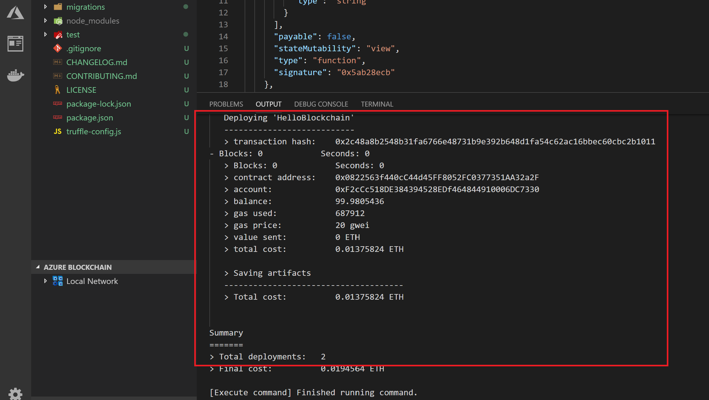

## **Scenario 2 - Build and Deploy Your Contract**

The basic contract is ready to be built and deployed, as is. You may also add/edit this contract to fit your needs. 

Follow the instructions below to build your basic "HelloBlockchain" contract:

1. Right click on your contract.sol
2. Select `Build Contracts`

`Note: The build contract action, from either palette or right-click shortcut will build all contracts in your directory automatically.`

The result of building your contract is to have the compiled contract code, application binary interface (ABI) and other common Solidity metadata created and added into the `./build` directory. 

The build artifacts and directory structure leverage the [Truffle Suite](https://truffleframework.com/) of tools and are compatible with any Truffle automation or scripts that depend on that framework.

## Deploy your smart contract

#### Local deployment

Follow the instructions below to deploy your basic "HelloBlockchain" contract:

1. Right click on your contract.sol
2. Select `Deploy Contracts`

3. If a developer has not already connected to an Azure Blockchain Service or any other type of network, the default option will allow a developer to deploy their contract to an emulated Ethereum network.

   Select `development` from the dropdown menu

   

Selecting the `development` network from the pick list will deploy your contracts to a local Ganache powered network. Deployment information, such as contract address, transaction hash and other deployment metadata are published in the Azure Blockchain output channel as shown below

It is worthwhile highlighting some of the key output parameters from the above local (Ganache) deployment:

- contract address: This is the address of the deployed "Helloworld" contract on the ledger. You may use this contract address to interact with your contract functions
- account: This is the account used to sign/send the contract. The account is autogenerated by the tool for you
- balance, gas, value and cost fields: Ganache is an Ethereum ledger emulator. As such, it also emulates the functions/parameters needed to send contracts to the public network. These functions/parameters include Eth and other parameters that apply to public networks. 
  - `Please note: This is not real ETH, nor are there any monetary costs associated. These values are simply for simulation`
- Total deployments: note, in this example there were 2 deployments. Every deployment using the Truffle framework includes a "migrations" contract which is used to manage adding other contracts to the ledger. Thus the "Helloworld" contract deployment included the migrations contract, thus deployments == 2

> This completes this scenario. Click on ***\*Next\**** to go to the next scenario.