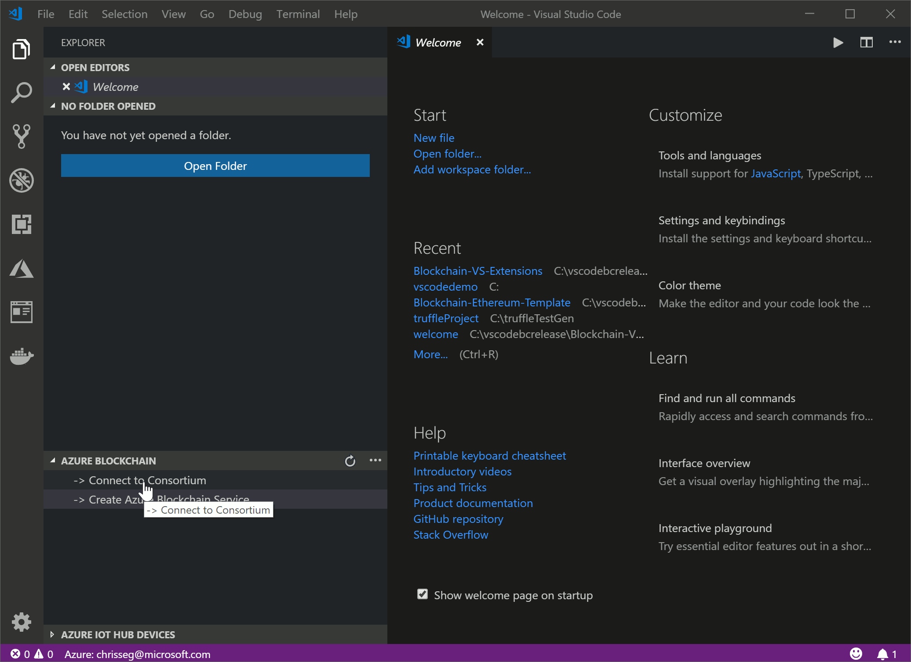
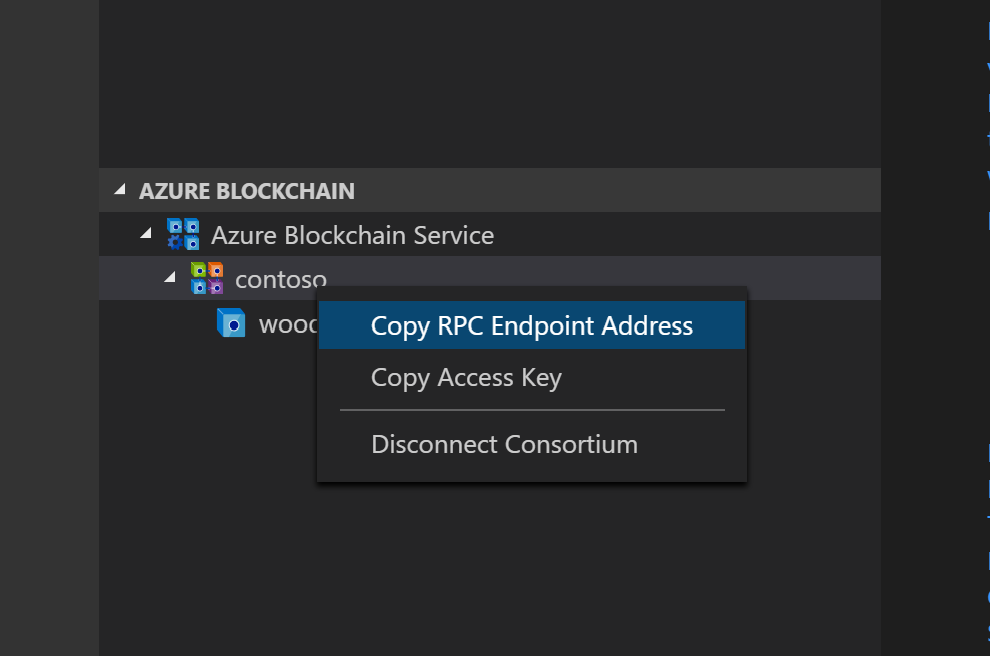
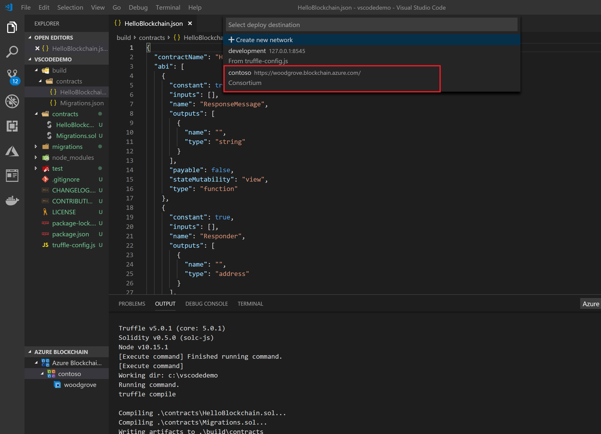
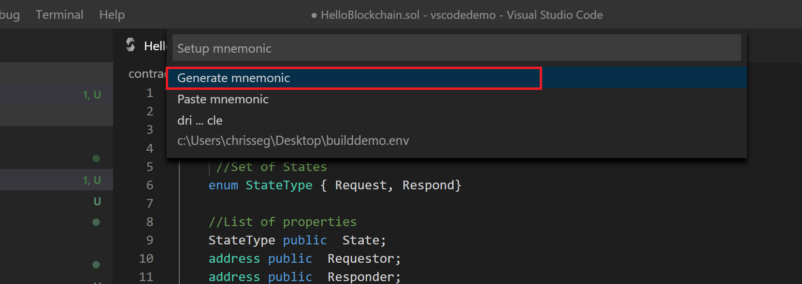
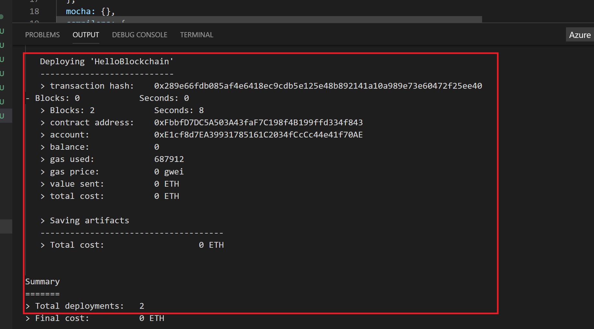
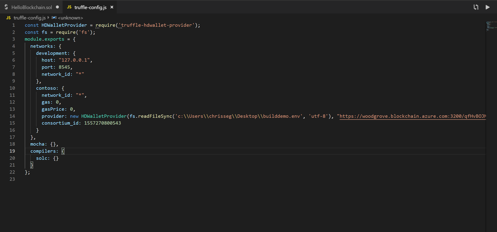
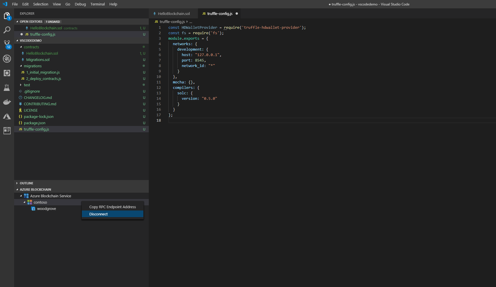

## **Scenario 3 - Connect and Deploy Your Contract to Azure Blockchain Service**

## Connect to an existing Azure Blockchain Service

If you have an existing Azure Blockchain Service deployed, you may connect to it through VS Code and use that instance (or multiple if you have several) to deploy contracts to and interact with in the IDE. To connect to an existing Azure Blockchain Service, follow the steps below. 

1. Chose `Connect to Consortium` from either the AZURE BLOCKCHAIN tab, or the command palette
2. Follow the prompts to select your subscription and resource group

## Interact with your consortium

After connecting to your consortium, your `AZURE BLOCKCHAIN` tab will show the connected consortium. In this view, you have the option of getting key connection information by right-clicking on the member node as shown below.

1. `Copy RPC Endpoint Address` copies the RPC endpoint address into your copy and paste buffer so that you may use it in other locations (e.g., when creating Azure Logic Apps using the Azure Ethereum Logic App Connector). 
2. `Copy Access Key` copies just the access key (a subset of the RPC endpoint address) into the copy/paste buffer

#### Azure Blockchain Service Deployment

Deploying a smart contract to Azure Blockchain Service follows the same steps as a local deployment. In this lab, you do not need to build the smart contract as you have previously built this contract in the previous step. 

After connecting to your Azure Blockchain Service, you may deploy your contract via right-click on the contract, or using the command palette. Available Azure Blockchain Service nodes available for deployment are shown in the quick-pick list for deployment options as shown below:

1. Right click on your solidity contract
2. select `deploy`
3. Select the consortium you recently connected in the previous step

Deploying contracts to Azure Blockchain Service require the contracts be signed with a private key. This is the same process, and uses the same key generators as deploying contracts to the public mainnet networks. The process to create/generate a key starts with creating, or using, a 12 word phrase (mnemonic) to create the key. 

 4. Generate a new key

Developers may generate a new key automatically, though the extension. The extension will ask the developer to save the key in a file with a `.env` extension. 

###### Post deployment

Highlighting some differences in deploying to Azure Blockchain Service-vs-local deployment, let's look at the output provided in the Azure Blockchain channel, as well as some modifications to the Truffle configuration found in `truffle-config.js`

First, let's look at the output from our deployment

- contract address: similar to the deployment to the local Ganache network, this deployment provides a contract address. However, this address is the contract address in your Azure Blockchain Service ledger, rather than a local, temporary network.
- account: similar to local deployment, this is a locally generated system account 
- balance, gas, cost etc: In the case of Azure Blockchain Service, this is a private network, so there is zero "cost" associated with deploying contracts onto this network
- Total deployments: Note, we also leverage the power of the Truffle framework "migrate" capabilities, which leverage a "migrations" contract to help facilitate contract deployments. 

Finally, let's look at the automated changes to the `truffle-migrate.js` file. This file is used to help direct Truffle in terms of where and how to connect to various consortiums. 

Once we connect to an Azure Blockchain Service, the Azure Blockchain Development Kit extension will modify the truffle-config.js file to include connection information for any network you add. For example, as we connect to an existing Azure Blockchain Service, you'll note we updated the `truffle-config.js` to add the location of your mnemonic `.env` file and the endpoint address of your consortium transaction node. 

## Disconnect your consortium

If you want to remove a consortium, whether a local (Ganache) or Azure Blockchain Service from your tree view (this process will NOT delete/remove any resources, deployed contracts etc. it simply removes the view from your IDE)

1.  select `Disconnect Consortium` when right-clicking on the consortium name as shown below

> This completes this scenario. Click on ***\*Next\**** to go to the next scenario.