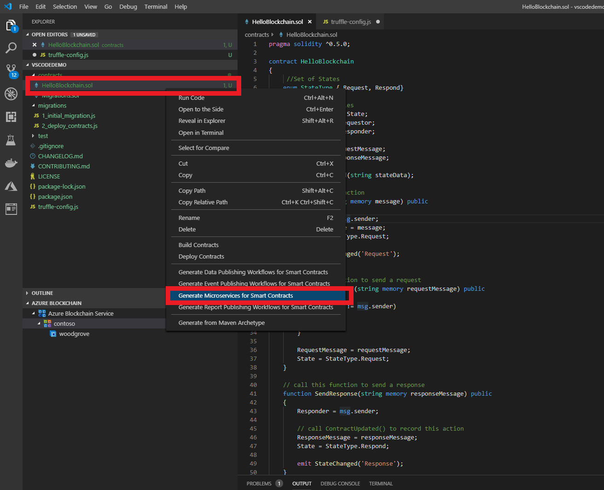
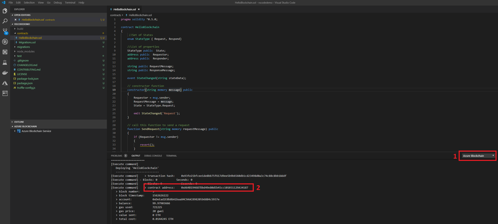
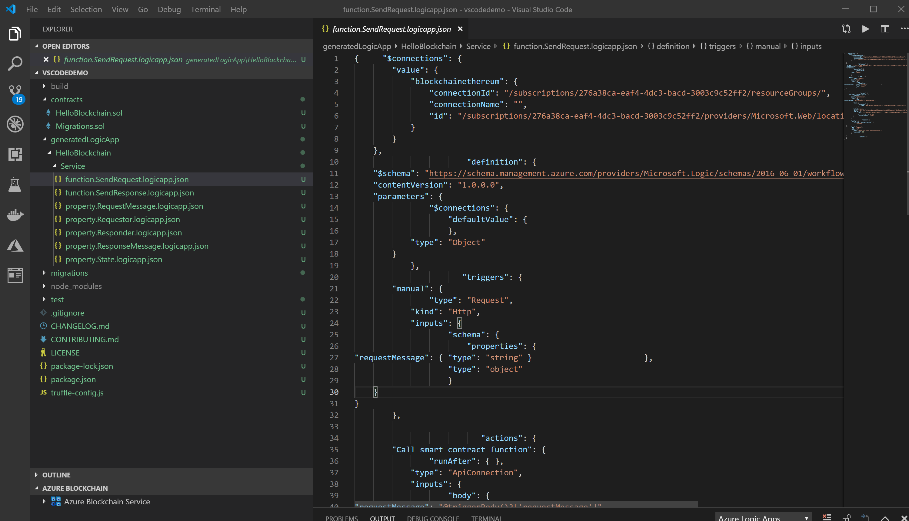
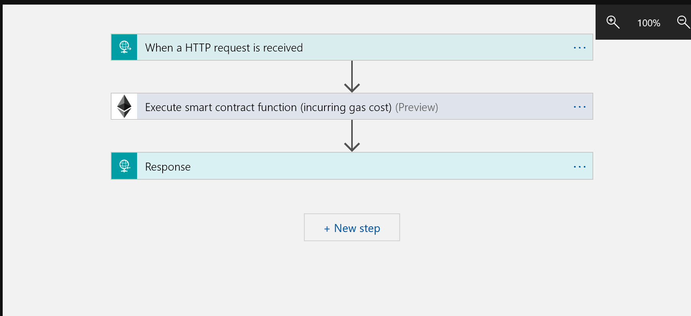

## **Scenario 4 - Generate Microservices for Your Smart Contract**

The Azure Blockchain Development Kit for Ethereum includes the functionality to automatically generate micro-services for smart contracts. It provides the ability to generate services that expose the functions and state of a smart contract from within Visual Studio Code. These services can be created as Logic Apps, Flows, or Azure Functions.

## Generating Logic Apps

Right click on your smart contract and select “Generate Microservices for Smart Contracts”

1. When prompted, select Logic App.

2. Next, provide the address for the contract. You may find the deployed address from your last step (deploy to Azure Blockchain Service) by following these steps

  - In your VS Code output window, select `Azure Blockchain` as the source (step 1 below)

  - Then scroll through the output to find the contract deployment address (step 2 below)

    

3. Next, select the subscription you will be deploying the Logic App into.

4. Next, select the resource group you will be deploying the Logic App into.

5. This will create a `generatedLogicApp` directory in your project and populate it with JSON files that can be used with Logic Apps. Logic Apps are created and configured to provide a REST interface to access the functions and state of your smart contract.

6. Inside the `generatedLogicApp` directory, traverse the directory tree and open up the `function.SendRequest.logicapp.json` file. 

  

Looking at the .json file, you may recognize this as a the JSON description of a logic app - or more correctly a series of logic apps. 

If you were to cut and paste this JSON description into the logic app designer in the Azure Portal you will see a logic app flow similar to the one below:

Looking at the logic app flow, you see that this logic app is triggered upon an HTTP request (a REST-ful service), which then triggers the [Ethereum Logic App connector](https://docs.microsoft.com/en-us/connectors/blockchainethereum/) to execute a smart contract function. If you were to open that logic app up and look at the details, you would see that the function being exercised is the `SendRequest` function from your smart contract. The successful execution of the action from the Ethereum connector then sends a HTTP status code of "200" or "ok", thus giving the developer a simple way to create simple microservices around their contract functions.

> This completes the lab.

