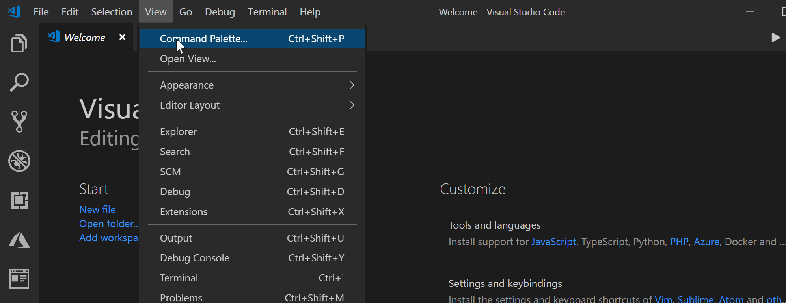

**Azure Blockchain Development Kit**

_Getting started with the VS Code extension for Blockchain_

## **Overview**

The Azure Blockchain Development Kit for Ethereum is a VS Code extension which helps developers quickly come up to speed on creating and deploying a smart contract onto public, private or local (development) blockchains. In this lab session you will use the extension to scaffold out a basic smart contract (written in a language called Solidity) and understand the various components of the scaffolded-out environment.

Once we have a smart contract, we will then compile and deploy that contract to a local environment, then finally connect to (and deploy) to an Azure Blockchain Service ledger.

In the last scenario we will then look at some of the new, more advanced features in the Azure Blockchain Development extension which helps developers create services (via Azure Functions, Logic Apps or Microsoft Flow) around their smart contracts.

- This extension provides several commands for interacting with ledgers, building, compiling and testing your smart contract as well as several features designed to help you integrate ledgers with other systems such as SQL Server, IoT Hub etc. These features are enabled through the Command Palette and/or through several "right click" short cut menus. 

  To access the Command Palette, you may choose *View, Command Palette* from the VS Code menu, or `ctrl+shift+p`

  

  
